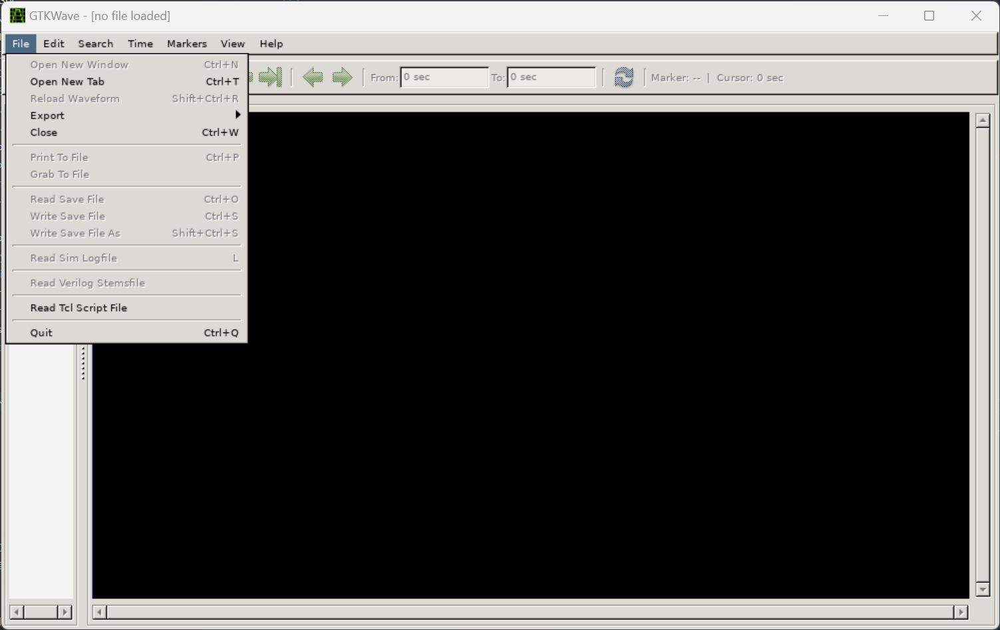
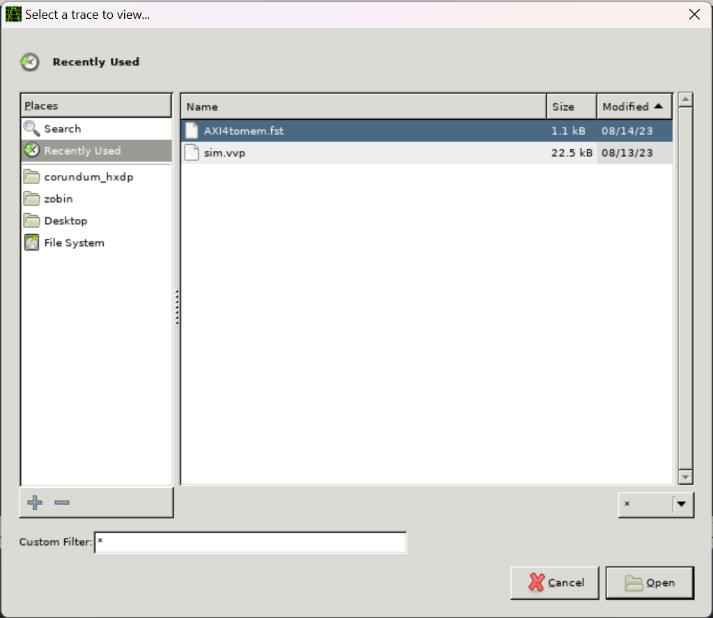
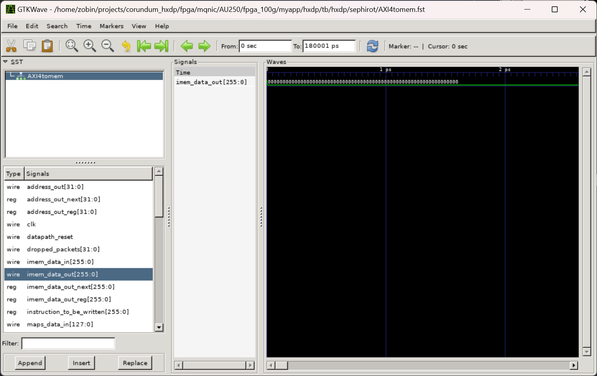

# How to run simulation?

1. create new conda environment

```bash
conda create --prefix=./env python=3.10
conda activate ./env
```

2. install dependencies

```bash
sudo apt-get install iverilog gtkwave
pip cache purge
pip install cocotb cocotb-bus cocotb-test cocotbext-axi cocotbext-eth cocotbext-pcie pytest scapy tox pytest-xdist pytest-sugar
```

3. running simulations

```bash
cd hxdp/sephirot
make
```

4. openning simulation wave

* bash `gtkwave` to open it, click File -> Open New Tab



* then open `AXI4tomem.fst`



* you can check the signals now

